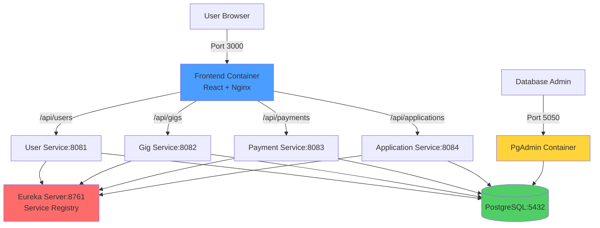

# UniGIG Deployment & Infrastructure Overview

## 🎯 Quick Summary

Your project has **multiple deployment options** but **nothing is running locally by default**. Everything runs in **containers** (Docker or Kubernetes). Here's what's going on:

---

## 📦 Project Architecture

### **Services (Microservices)**
1. **Eureka Server** (Port 8761) - Service Discovery/Registry
2. **User Service** (Port 8081) - Manages users (students, professors)
3. **Gig Service** (Port 8082) - Manages gigs/tasks
4. **Payment Service** (Port 8083) - Handles payments & wallets
5. **Application Service** (Port 8084) - Manages internship applications
6. **Frontend** (Port 3000/80) - React app with Nginx reverse proxy
7. **PostgreSQL** (Port 5432) - Database (Hosting 4 separate logical DBs: user_db, gig_db, payment_db, application_db)
8. **PgAdmin** (Port 5050) - Database management UI

---

## 🚀 Deployment Options

Your project supports **TWO main deployment strategies**:

### **Option 1: Docker Compose (Simpler)**

#### Files:
- [`docker-compose.yml`](file:///home/aagnik/MSLab-project/MSLAB/docker-compose.yml) - **Database only** (Postgres + PgAdmin)
- [`docker-compose-full.yml`](file:///home/aagnik/MSLab-project/MSLAB/docker-compose-full.yml) - **Full stack** (all services)

#### How it works:
```bash
# Start everything
docker compose -f docker-compose-full.yml up --build -d
```

**What happens:**
1. Each service has a [`Dockerfile`](file:///home/aagnik/MSLab-project/MSLAB/user-service/Dockerfile) that:
   - Uses **multi-stage builds** (Maven build → Java runtime)
   - Backend: Builds Java app with Maven, runs with Java 17
   - Frontend: Builds React with Node, serves with Nginx
2. Docker Compose orchestrates all containers
3. Services communicate via **internal Docker network**
4. Frontend Nginx acts as **reverse proxy** to backend services

**Key Feature - Nginx Reverse Proxy:**
The [`nginx.conf`](file:///home/aagnik/MSLab-project/MSLAB/frontend/nginx.conf) routes API calls:
- `/api/users` → `user-service:8081`
- `/api/gigs` → `gig-service:8082`
- `/api/payments` → `payment-service:8083`
- `/api/applications` → `application-service:8084`

This means you **only expose port 3000** to access everything!

---

### **Option 2: Kubernetes (Production-like)**

#### Files in [`k8s/`](file:///home/aagnik/MSLab-project/MSLAB/k8s) directory:
- `eureka-deployment.yaml`
- `user-deployment.yaml`
- `gig-deployment.yaml`
- `payment-deployment.yaml`
- `application-deployment.yaml`
- `frontend-deployment.yaml`

#### How it works:
```bash
# Deploy to Kubernetes (Minikube/any cluster)
kubectl apply -f k8s/

# Access via port-forwarding
kubectl port-forward svc/frontend 3000:80
```

**What happens:**
1. Each YAML defines a **Deployment** (pod specs) and **Service** (networking)
2. Images are built locally first (using Dockerfiles)
3. Kubernetes pulls images with `imagePullPolicy: Never` (local images)
4. Services discover each other via Kubernetes DNS (e.g., `http://user-service:8081`)
5. You use `kubectl port-forward` to access services from your machine

**Example:** [`user-deployment.yaml`](file:///home/aagnik/MSLab-project/MSLAB/k8s/user-deployment.yaml)
- Creates 1 replica of user-service
- Exposes port 8081
- Connects to Eureka at `http://eureka-server:8761/eureka/`

---

## 🧪 Testing Infrastructure

### **Unit Tests**
Each service has JUnit tests using **Spring Boot Test** framework:

**Example:** [`UserServiceTest.java`](file:///home/aagnik/MSLab-project/MSLAB/user-service/src/test/java/com/unigig/user/UserServiceTest.java)
- Uses `MockMvc` to test REST endpoints
- Uses **H2 in-memory database** for tests (see [`pom.xml`](file:///home/aagnik/MSLab-project/MSLAB/user-service/pom.xml#L39-L42))
- Tests run in isolation without needing real Postgres

**Run tests:**
```bash
cd user-service && mvn test
cd gig-service && mvn test
cd payment-service && mvn test
```

### **Integration Testing**
The Docker Compose setup with **health checks** ensures:
- Postgres is ready before services start
- Services wait for Eureka to be available
- See [`docker-compose-full.yml`](file:///home/aagnik/MSLab-project/MSLAB/docker-compose-full.yml#L16-L20) for health check example

---

## 🔍 Where Things Actually Run

### **Local Development (Current State)**
Based on your setup, **NOTHING runs directly on your machine**. Everything runs in:

1. **Docker containers** (if using Docker Compose)
   - Isolated network: `unigig_default`
   - Volumes for data persistence: `postgres_data`

2. **Kubernetes pods** (if using K8s)
   - Minikube cluster (or other K8s cluster)
   - Services communicate via cluster DNS

### **Why Containerization?**
✅ **Consistency:** Same environment everywhere  
✅ **Isolation:** Services don't conflict  
✅ **Scalability:** Easy to add replicas  
✅ **Microservices:** Each service is independent  

---

## 🌐 Cloud/Deployment Notes

### **What I Found:**
- ❌ No Terraform files (no infrastructure-as-code)
- ❌ No CI/CD pipelines (no GitHub Actions, Jenkins, etc.)
- ❌ No cloud provider configs (no AWS, GCP, Azure)

### **What You Have:**
✅ **Docker images** ready to push to registries (Docker Hub, ECR, etc.)  
✅ **Kubernetes manifests** ready for any K8s cluster (EKS, GKE, AKS)  
✅ **Multi-stage Dockerfiles** optimized for production  

### **To Deploy to Cloud:**
You would need to:
1. Push images to a container registry
2. Update K8s YAML to use remote images (change `imagePullPolicy: Never`)
3. Deploy to cloud K8s cluster
4. Set up ingress/load balancer instead of port-forwarding

---

## 📊 Architecture Diagram



---

## 🎮 How to Use Each Deployment Method

### **Docker Compose (Recommended for Demo)**

```bash
# Start everything
docker compose -f docker-compose-full.yml up --build -d

# Access
# Frontend: http://localhost:3000
# Eureka: http://localhost:8761
# PgAdmin: http://localhost:5050

# Stop everything
docker compose -f docker-compose-full.yml down
```

### **Kubernetes (For Learning/Production-like)**

```bash
# Build images first
docker build -t user-service:latest ./user-service
docker build -t gig-service:latest ./gig-service
docker build -t payment-service:latest ./payment-service
docker build -t application-service:latest ./application-service
docker build -t eureka-server:latest ./eureka-server
docker build -t frontend:latest ./frontend

# Deploy to K8s
kubectl apply -f k8s/

# Check status
kubectl get pods

# Access frontend
kubectl port-forward svc/frontend 3000:80

# Access Eureka dashboard
kubectl port-forward svc/eureka-server 8761:8761
```

---

## 🔑 Key Takeaways

1. **Nothing runs locally** - Everything is containerized
2. **Two deployment options** - Docker Compose (simple) or Kubernetes (advanced)
3. **Nginx reverse proxy** - Frontend routes all API calls through one port
4. **Service discovery** - Eureka helps services find each other
5. **Testing** - Unit tests use H2 in-memory DB, integration via Docker health checks
6. **No cloud deployment yet** - But ready to deploy (just need to push images and configure K8s)
7. **Database persistence** - Docker volumes ensure data survives container restarts

---

## 📚 Reference Files

- **Deployment:** [`docker-compose-full.yml`](file:///home/aagnik/MSLab-project/MSLAB/docker-compose-full.yml), [`k8s/`](file:///home/aagnik/MSLab-project/MSLAB/k8s)
- **Build:** All [`Dockerfile`](file:///home/aagnik/MSLab-project/MSLAB/user-service/Dockerfile)s in each service directory
- **Networking:** [`nginx.conf`](file:///home/aagnik/MSLab-project/MSLAB/frontend/nginx.conf)
- **Testing:** [`pom.xml`](file:///home/aagnik/MSLab-project/MSLAB/user-service/pom.xml), Test files in `src/test/`
- **Guides:** [`README.md`](file:///home/aagnik/MSLab-project/MSLAB/README.md), [`demo_guide.md`](file:///home/aagnik/MSLab-project/MSLAB/demo_guide.md)
