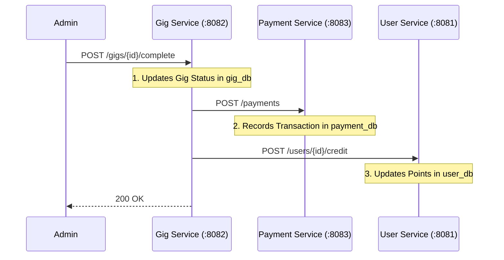

# UniGIG Presentation Bundle

This document combines the **Professor's Guide**, **Communication Map**, and **Demo Script** into one file for easy reference during your presentation.

---

# PART 1: PROFESSOR'S TECHNICAL GUIDE

This section explains the technical architecture of UniGIG, focusing on the API Gateway, Service Discovery (Eureka), and Inter-Service Communication. Use this to respond to technical questions.

## 1. The API Gateway pattern
**Question:** "How does the frontend communicate with multiple backend services?"

**Answer:** 
We use **Spring Cloud Gateway** as the single entry point. Instead of the frontend calling `user-service` (:8081) or `gig-service` (:8082) directly, it sends **all requests to the Gateway on port 8080**.

### How it works (The Code)
The routing logic is defined in `api-gateway/src/main/resources/application.yml`.

```yaml
spring:
  cloud:
    gateway:
      routes:
        - id: user-service
          uri: lb://USER-SERVICE  # 'lb' means Load Balanced (looks up Eureka)
          predicates:
            - Path=/api/users/**  # Matches frontend requests
          filters:
            - RewritePath=/api/(?<segment>.*), /$\{segment} # Removes '/api' prefix
```

## 2. Service Discovery (Eureka Cloud)
**Question:** "How do services perceive each other in the cloud?"

**Answer:**
We use **Netflix Eureka Server** as a Service Registry.
1. **Eureka Server**: Runs on port `8761`. It's the "phonebook".
2. **Eureka Clients**: Every microservice (User, Gig, Payment, Application) registers itself with Eureka on startup.

## 3. Inter-Service Communication
**Question:** "How do microservices talk to each other? Do they share databases?"

**Answer:**
**NO**, they do NOT share databases. They communicate via **REST APIs** (HTTP) using `RestTemplate`. This maintains strict isolation.

### Example: Completing a Gig
When a student completes a gig, `Gig Service` needs to:
1. **Pay the student** (Call Payment Service).
2. **Give points** (Call User Service).
3. **Notify Application Service** (to delete stale apps).

**Data Flow Diagram:**


---

# PART 2: COMMUNICATION MAP (UPDATED CHEATSHEET)

Here is the exact code where your services talk to each other. **Show these lines to prove robust integration.**

## 1. Application Service -> Gig Service (Syncing Applicants)
**Scenario:** When a student Applies, the Application Service notifies Gig Service to add them to `applicantIds`.

**File:** `application-service/.../ApplicationController.java`
**Method:** `apply`

```java
// ... inside apply() ...
String gigServiceUrl = "http://gig-service:8082/gigs/" + application.getGigId() + "/apply?studentId=" + application.getStudentId();
restTemplate.postForEntity(gigServiceUrl, null, Object.class);
```

## 2. Application Service -> Gig Service (Approvals/Rejections)
**Scenario:** When an Admin Approves/Rejects, update the Gig Service state immediately.

**File:** `application-service/.../ApplicationController.java`
**Method:** `approve` / `reject`

```java
// ... inside approve() ...
String gigServiceUrl = "http://gig-service:8082/gigs/" + app.getGigId() + "/approve?studentId=" + app.getStudentId();
restTemplate.postForEntity(gigServiceUrl, null, Object.class);
```

## 3. Gig Service -> Application Service (Cascade Delete)
**Scenario:** If an Admin **Deletes a Gig**, we must delete all pending applications to prevent "Phantom Data".

**File:** `gig-service/.../GigController.java`
**Method:** `deleteGig`

```java
// ... inside deleteGig() ...
gigRepository.deleteById(id);

// Cascade delete applications (Inter-Service Call)
String appServiceUrl = "http://application-service:8084/applications/gig/" + id;
restTemplate.delete(appServiceUrl);
```

## 4. Gig Service -> Payment & User Service (Completion)
**Scenario:** When a Gig is completed, Pay the student and Give them points.

**File:** `gig-service/.../GigController.java`
**Method:** `completeGig`

```java
// 1. Credit User Points
String userServiceUrl = "http://user-service:8081/users/" + studentId + "/credit?points=" + points + "&gigs=" + gigs;
restTemplate.postForEntity(userServiceUrl, null, Void.class);

// 2. Record Payment
String paymentServiceUrl = "http://payment-service:8083/payments";
restTemplate.postForEntity(paymentServiceUrl, transaction, Object.class);
```

---

# PART 3: DEMO SCRIPT

Follow this script to give a professional demonstration of your microservices project.

## 1. The "Infrastructure" Layer (Show this first)
**Goal:** Prove that you have a real microservices architecture, not just a folder of code.

1.  **Open Eureka Dashboard** (`http://localhost:8761`).
    *   *Say:* "Here is the Service Registry. You can see all my microservices (User, Gig, Payment, Application) have discovered each other and are UP."
2.  **Open API Gateway** (`http://localhost:8080/actuator/health` or just explain it).
    *   *Say:* "All traffic goes through the Gateway on port 8080. It handles routing so the frontend doesn't talk to services directly."

## 2. The "Network Verification" (Crucial for Professor)
**Goal:** Prove the Gateway is actually working and secure.

**Step-by-Step Explanation for the Network Tab:**

1.  **Point to the "Domain" Column:**
    *   *What they see:* `localhost:8080` for every request (`login`, `gigs`, `1`).
    *   *What you say:* "Professor, notice the Domain column. Every single request is hitting **port 8080**. This is my API Gateway. The frontend has **no idea** that the User Service is on 8081 or Gig Service is on 8082. This proves the architecture is decoupled."

2.  **Point to the Status Code:**
    *   *What they see:* `200 OK` (Green).
    *   *What you say:* "We have clean `200 OK` responses, meaning the Gateway is successfully routing traffic and handling the CORS security handshake automatically."

3.  **Click on the `login` Request:**
    *   *What to show:* The "Headers" tab on the right.
    *   *What you say:* "If we look closer, the Gateway injects the `Access-Control-Allow-Origin` header, allowing my frontend to connect securely."

## 3. The "User Story" (The actual Demo)
**Goal:** Show functionality.

1.  **Login as Student** (Frontend `http://localhost:3000`).
2.  **Apply for a Gig**.
3.  **Login as Admin**.
4.  **Approve the Application**.
5.  **Mark the Gig as Completed**.
    *   *Say:* "When I click 'Complete', the Gig Service communicates with the Payment Service to record the transaction."
6.  **Switch back to Student**.
    *   *Show:* "Total Earnings" increased.
    *   *Say:* "This data is now coming from the Payment Service database, confirming the microservices integration."

## 4. The "Under the Hood" (Deep Dive)
**Goal:** Show the code working.

Instead of just the "Running on port" page, show the **Raw Data**:
1.  **Show User Data**: Go to `http://localhost:8080/api/users`.
    *   *Result:* You see JSON data.
    *   *Say:* "This is the raw JSON response from the User Service, routed via the Gateway."
2.  **Show Gig Data**: Go to `http://localhost:8080/api/gigs`.
3.  **Show Payment Data**: Go to `http://localhost:8080/api/payments`.
    *   *Say:* "Here is the transaction we just created."

## 6. Advanced Business Logic (Bonus Points)
**Goal:** Show that you handled edge cases.

1.  **The "3-Gig Limit" Rule**:
    *   *Say:* "To prevent spam, we limited students to 3 active gigs. If I try to apply for a 4th one, the backend throws a custom exception."
2.  **Cascade Deletion**:
    *   *Say:* "If I delete a Gig as an Admin, the system automatically cleans up all related student applications to maintain database integrity."
